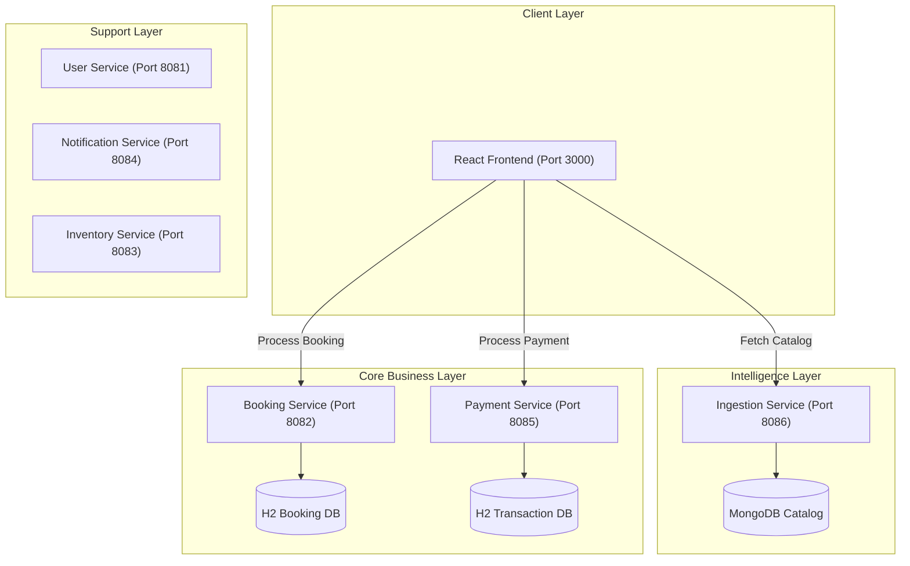

# Platform Central: Architecture & Integration Map

This document outlines the distributed microservices architecture of **Platform Central**, detailing service roles, communication ports, and the frontend-to-backend orchestration flow.

## 🏗️ System Overview

The platform is built on a **Decentralized Service Mesh** architecture where the Frontend acts as the primary orchestrator, communicating directly with specialized microservices.

---

## 📋 Service Catalog

| Service Name | Port | Database | Primary Responsibility |
| :--- | :--- | :--- | :--- |
| **Ingestion Service** | `8086` | MongoDB (Cloud) | Asset marketplace catalog, product types, and search. |
| **Booking Service** | `8082` | H2 (InMemory) | Reservation lifecycle, status management (PENDING, CONFIRMED). |
| **Payment Service** | `8085` | H2 (InMemory) | Transaction ledger, payment processing, revenue tracking. |
| **User Service** | `8081` | H2 (InMemory) | User profiles, identity management, and security context. |
| **Notification Service** | `8084` | - | Alerting logic, email templates, and system signals. |
| **Inventory Service** | `8083` | H2 (InMemory) | Legacy inventory tracking (Maintenance Mode). |

---

## 🔄 Interaction Flow (Where Services are Used)

### 1. Asset Discovery & Marketplace
- **Location**: `Asset Marketplace` (Frontend: `/bookings`)
- **Interaction**: Frontend uses `ingestionService.js` to call `8086/api/v1/products`.
- **Purpose**: Retrieves live movie listings, restaurant tables, and workspaces.

### 2. Transaction Flow (Checkout)
- **Location**: `Checkout Flow` (Frontend: `/checkout`)
- **Interaction**:
    1.  **Booking**: Calls `bookingService.js` -> `8082/api/v1/bookings` to reserve an asset.
    2.  **Payment**: Calls `bookingService.js` -> `8085/api/v1/payments/process` to settle the amount.
- **Outcome**: A bridge is formed between the Booking (Asset) and the Ledger (Payment).

### 3. Administrative Resource Management
- **Location**: `Platform Administration` (Frontend: `/admin`)
- **Interaction**: Frontend calls `ingestionService.js` -> `8086/api/v1/categories` and `/products`.
- **Purpose**: Used for listing new assets, decommissioning items, and managing the global category registry.

### 4. System Intelligence (Monitoring)
- **Location**: `Telemetry Lab` (Frontend: `/telemetry`)
- **Interaction**: Collates simulated and live health checks across the service mesh.

---

## 🛠️ Developer Reference

- **Frontend Tech**: React, CSS Grid (Enterprise-grade), Axios.
- **Backend Tech**: Spring Boot 3.x, Spring Data JPA/MongoDB, H2/Altas.
- **CORS Policy**: All backend services are open (`@CrossOrigin("*")`) for local direct communication.
